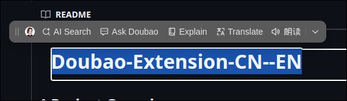

# Doubao-Extension-CN--EN

## Project Overview
This simple project just aims to translate the Doubao browser extension to English, making it more accessible to those that don't know Chinese. I really love Doubao and I hope to be able to continue using it despite upcoming regulatory changes.

### 1. Source Files
- `combined_chunks.txt`: This file contains all the translation entries in the format of `key=value`. These key-value pairs represent the original text and its corresponding English translation.
- `static/js/i18n_resources.js`: This JavaScript file contains the original language strings that need to be translated. It uses `JSON.parse` to handle the strings.

### 2. Translation Script
The `apply_translations.py` script is responsible for performing the actual translation. Here's a breakdown of what it does:
- **Reading the JavaScript File**: It reads the content of `static/js/i18n_resources.js` and finds all instances of `JSON.parse` using regular expressions.
- **Processing Translation Entries**: It reads the `combined_chunks.txt` file line by line, parses the key-value pairs, and stores them in a dictionary. If there are any issues with parsing the value, it will print an error message and use the raw value as a fallback.
- **Replacing Strings**: It replaces all the `JSON.parse` instances in the JavaScript file with the actual translated strings from the dictionary.
- **Writing the Updated File**: Finally, it writes the updated content back to the `static/js/i18n_resources.js` file.

## Usage
To use this translation project, follow these steps:

1. Download the latest extension from https://www.doubao.com/browser-extension/download (it should auto download)
2. Extract the extension; it should have a crx file inside that's the packed extension files.
3. Unpack the crx by using unzip command (optionally rename it to end in .zip extension)
4. Place apply_translations.py and combined_chunks.txt in the extension's folder.
5. Run the Python script. If all goes well, most key elements will be translated.
6. In Chrome (for example), go to manage extensions, load unpacked, and pick the Doubao folder.
